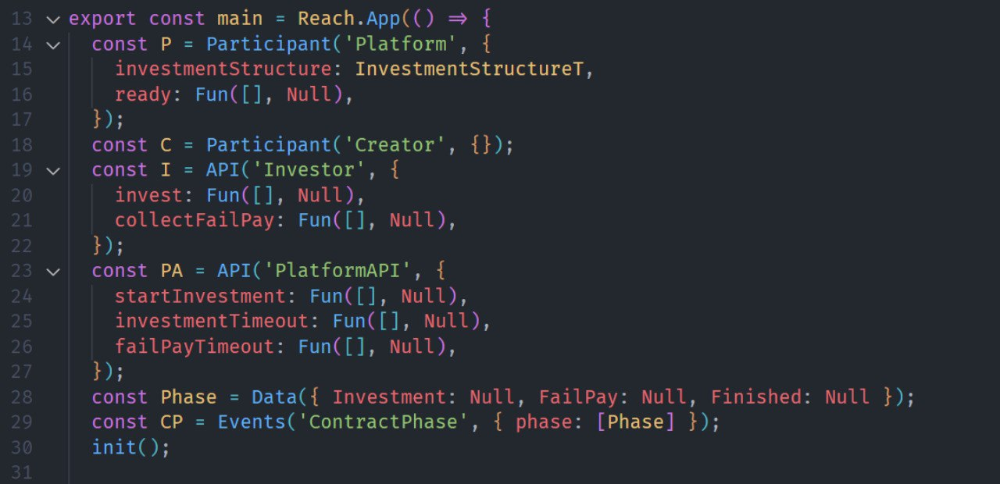
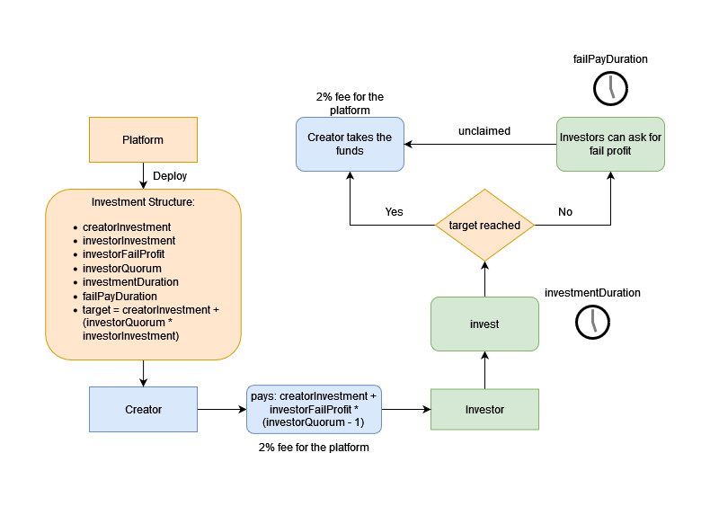
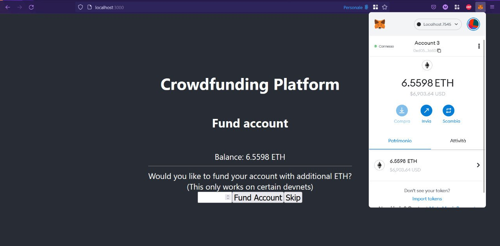
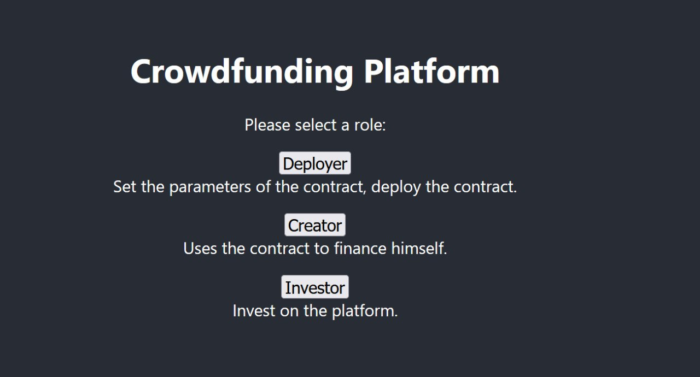
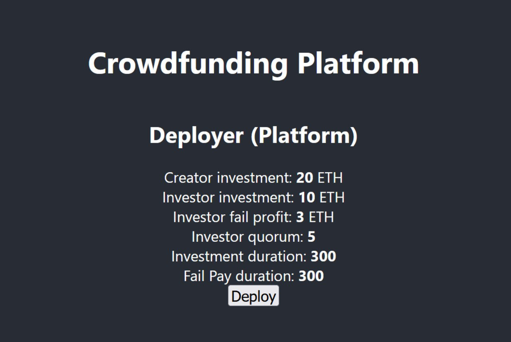
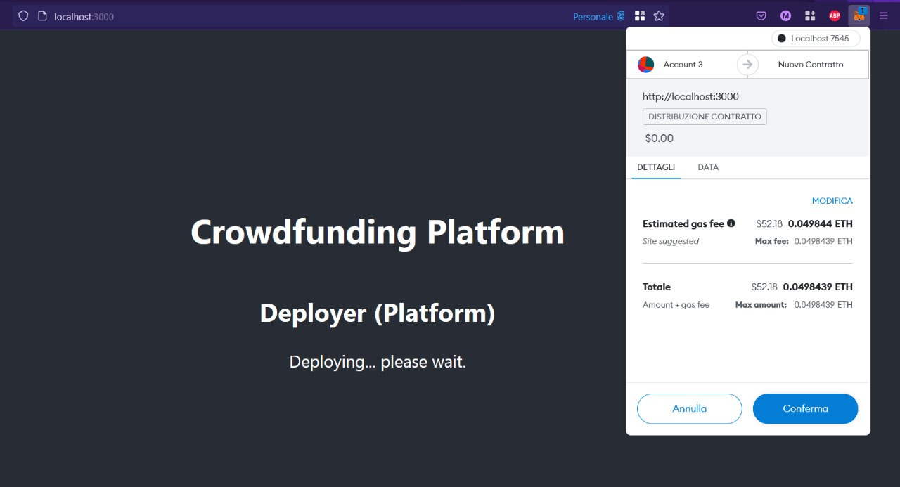
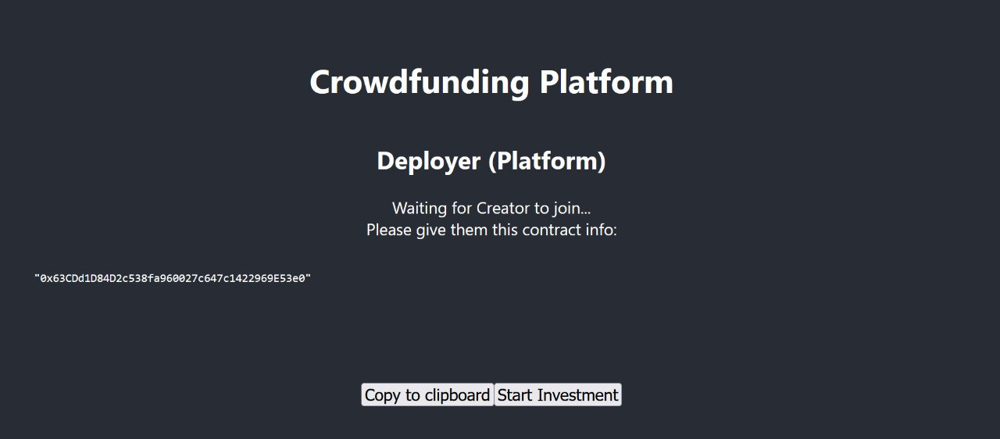
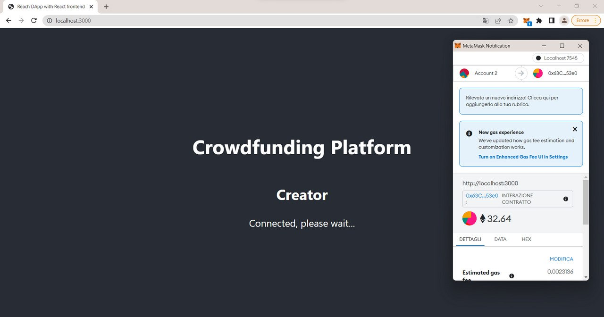

# Algofound

The sustainable launch station

## How does it work?

* The crowdfunding platform releases a smart contract on the Algorand blockchain by setting the parameters of target, duration, etc.
* A creator interested in being financed participates in the smart contract by paying the first investment and reserving a share as insurance for investors and a fee for the platform
* The number of investors allowed to invest cannot be changed after the contract deployment.
* If 100% of the funds to be raised are not reached the investors are going to get back the investment plus the insurance.
* Otherwise, the creator receives the profit or any unpaid investment.

## Frontend

The interface to use the contract is divided into different sections, one for each "entity" that interacts with the contract (Deployer, Creator, Investor)

## Develop Client

To run index.mjs:
Remove ".bac" from filename "index.mjs.bac"

`REACH_CONNECTOR_MODE=ALGO-devnet ./reach run`

To use the dapp:

`REACH_CONNECTOR_MODE=ETH-live ETH_NODE_URI="HTTP://127.0.0.1:7545" ./reach react`

To view dapp:

`http://localhost:3000`

## Resources

* [Algorand Developer Portal](https://developer.algorand.org/)
* [Truffle Framework](http://truffleframework.com/)
* [Ganache Local Blockchain](http://truffleframework.com/ganache/)
* [Reach Language Reference](https://docs.reach.sh/)
* [React.js](https://reactjs.org/)
* [Ethereum Blockchain Explorer](https://etherscan.io/)
* [Algorand Sandbox](https://github.com/algorand/sandbox#getting-started)

